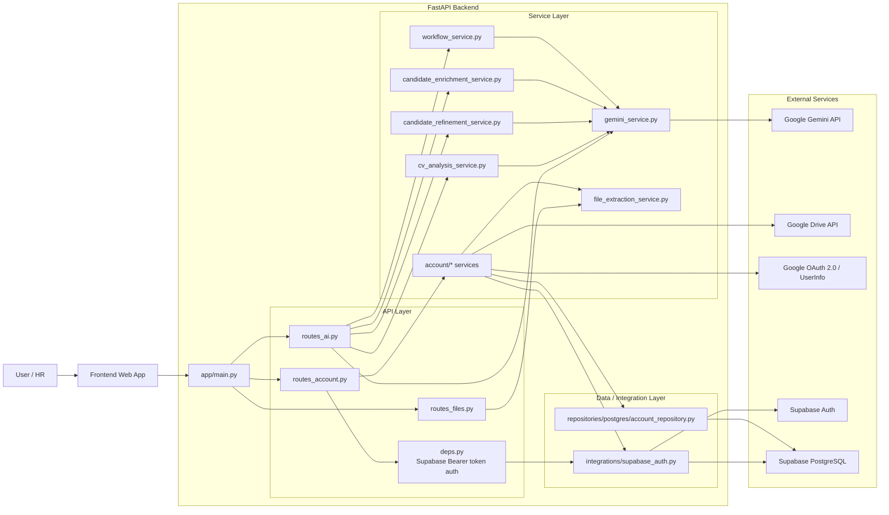
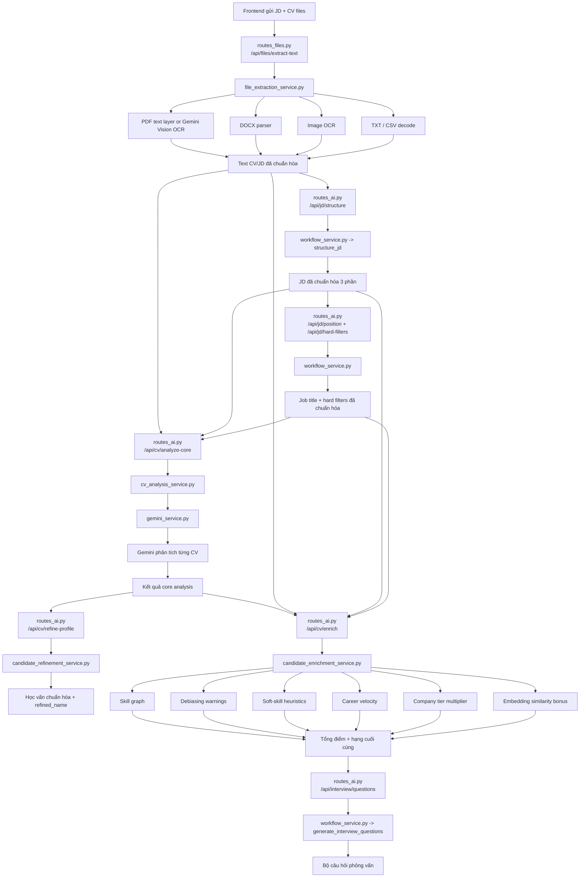
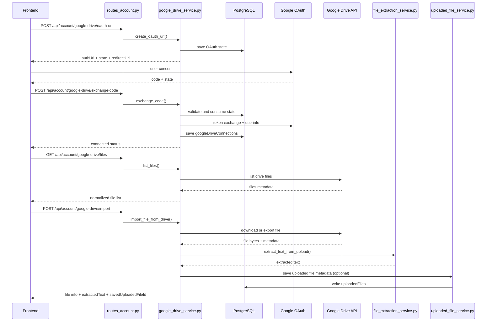
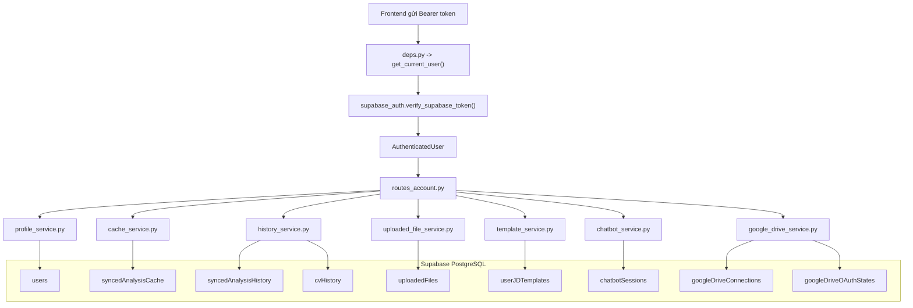

# Tài liệu Backend

Các file trong thư mục `docs` mô tả đúng những gì backend đang làm ở thời điểm hiện tại.

Mỗi thư mục con đại diện cho một mảng chức năng, và mỗi mảng có một file `README.md` riêng:

- `query-cache`: cơ chế cache kết quả phân tích theo người dùng và `cacheKey`
- `supabase-db`: mô hình dữ liệu PostgreSQL và các bảng đang được dùng
- `vector-embeddings`: phần embedding, cosine similarity, và "vector DB" hiện tại
- `matching-scoring`: logic so khớp CV/JD và cộng trừ điểm sau phân tích AI
- `file-extraction-ocr`: luồng upload file, trích xuất text, OCR
- `ai-workflows`: các workflow AI như chuẩn hóa JD, trích bộ lọc cứng, phân tích CV, sinh câu hỏi phỏng vấn
- `google-drive-import`: kết nối OAuth Google Drive, duyệt file, import file và trích text

## Luồng tổng quát của backend

1. Người dùng upload file hoặc import file từ Google Drive.
2. Backend trích text từ PDF, DOCX, ảnh, TXT hoặc CSV.
3. Backend dùng Gemini để phân tích CV theo JD và trọng số.
4. Backend enrich kết quả bằng luật nội bộ:
   - skill graph
   - career velocity
   - soft-skill heuristics
   - company tier
   - embedding similarity
5. Kết quả có thể được lưu vào:
   - cache đồng bộ
   - lịch sử phân tích
   - uploaded files
   - hồ sơ người dùng
   - chatbot sessions

## Sơ đồ hệ thống

### 1. Tổng quan hệ thống



Ý nghĩa:

- Frontend là nơi gọi toàn bộ API của backend.
- `routes_ai.py` xử lý các nghiệp vụ AI.
- `routes_files.py` phục vụ trích text/OCR.
- `routes_account.py` phục vụ tất cả dữ liệu theo user, đồng bộ, lịch sử, Google Drive.
- Supabase được dùng cho xác thực và PostgreSQL được dùng làm database chính.
- Gemini được dùng cho generate, OCR vision và embedding.

### 2. Kiến trúc nội bộ backend

```mermaid
flowchart TB
    subgraph ROUTES["Route Layer"]
        RAI2["routes_ai.py"]
        RF2["routes_files.py"]
        RAC2["routes_account.py"]
    end

    subgraph SCHEMAS["Schema Layer"]
        SACC["schemas/account.py"]
        SAN["schemas/analysis.py"]
        SFI["schemas/files.py"]
        SGE["schemas/gemini.py"]
        SWF["schemas/workflows.py"]
    end

    subgraph SERVICES["Business Service Layer"]
        GS2["gemini_service.py"]
        FES2["file_extraction_service.py"]
        CVS2["cv_analysis_service.py"]
        CRS2["candidate_refinement_service.py"]
        CES2["candidate_enrichment_service.py"]
        WFS2["workflow_service.py"]
    end

    subgraph ACCSERV["Account Service Layer"]
        PS["profile_service.py"]
        CAS["cache_service.py"]
        HS["history_service.py"]
        UFS["uploaded_file_service.py"]
        TS["template_service.py"]
        CBS["chatbot_service.py"]
        GDS["google_drive_service.py"]
        SH["shared.py"]
    end

    subgraph STORAGE["Storage / Providers"]
        CFG["core/config.py"]
        FB2["integrations/supabase_auth.py"]
        REP2["repositories/postgres/account_repository.py"]
        FS["Supabase PostgreSQL"]
        GM2["Gemini API"]
        GD2["Google Drive API"]
        GO2["Google OAuth"]
        VEC["Embedding JSON library<br/>(expected external data files)"]
    end

    RAI2 --> SGE
    RAI2 --> SAN
    RAI2 --> SWF
    RF2 --> SFI
    RAC2 --> SACC

    RAI2 --> GS2
    RAI2 --> CVS2
    RAI2 --> CRS2
    RAI2 --> CES2
    RAI2 --> WFS2

    RF2 --> FES2

    RAC2 --> PS
    RAC2 --> CAS
    RAC2 --> HS
    RAC2 --> UFS
    RAC2 --> TS
    RAC2 --> CBS
    RAC2 --> GDS

    CVS2 --> GS2
    CRS2 --> GS2
    CES2 --> GS2
    CES2 --> VEC
    WFS2 --> GS2
    GDS --> FES2
    GDS --> UFS

    GS2 --> CFG
    FES2 --> CFG
    CVS2 --> CFG
    CRS2 --> CFG
    WFS2 --> CFG
    GDS --> CFG

    PS --> REP2
    CAS --> REP2
    HS --> REP2
    UFS --> REP2
    TS --> REP2
    CBS --> REP2
    GDS --> REP2

    REP2 --> FB2
    FB2 --> FS
    GS2 --> GM2
    GDS --> GD2
    GDS --> GO2
```



Ý nghĩa:

- `schemas/*` giữ hình dạng dữ liệu vào/ra.
- `services/*` chứa business logic.
- `repositories/*` và `integrations/*` là tầng nối với database và provider.
- `candidate_enrichment_service.py` là nơi kết hợp rule-based scoring và embedding similarity.

### 3. Pipeline phân tích CV/JD



Ý nghĩa:

- File phải qua bước trích text trước khi vào AI analysis.
- `cv_analysis_service.py` tạo điểm nền.
- `candidate_refinement_service.py` xử lý các chi tiết profile để đẹp hơn.
- `candidate_enrichment_service.py` mới là nơi điều chỉnh điểm cuối cùng.
- Cuối pipeline có thể sinh bộ câu hỏi phỏng vấn dựa trên kết quả đã phân tích.

### 4. Luồng import Google Drive và OCR



Ý nghĩa:

- Google Docs/Sheets/Slides không được tải trực tiếp như file thường, mà phải export sang định dạng trung gian.
- Sau khi tải file xong, backend đi lại cùng pipeline OCR/trích text như upload file local.
- Kết quả có thể được lưu vào `uploadedFiles` để frontend dùng lại.

### 5. Luồng auth, cache, history và dữ liệu người dùng



Ý nghĩa:

- Mọi route account quan trọng đều đi qua `deps.py` để xác thực Supabase token.
- Tất cả dữ liệu quan trọng đều được tách collection theo nghiệp vụ.
- `cache`, `history`, `uploaded files`, `templates`, `chatbot`, `Drive connection` là các kho dữ liệu độc lập nhưng đều gắn với `uid`.

## Cấu trúc tổng thể backend

```text
backend/
├─ app/
│  ├─ api/
│  │  ├─ deps.py
│  │  ├─ routes_account.py
│  │  ├─ routes_ai.py
│  │  └─ routes_files.py
│  ├─ core/
│  │  └─ config.py
│  ├─ integrations/
│  │  └─ supabase_auth.py
│  ├─ repositories/
│  │  └─ postgres/
│  │     └─ account_repository.py
│  ├─ schemas/
│  │  ├─ account.py
│  │  ├─ analysis.py
│  │  ├─ files.py
│  │  ├─ gemini.py
│  │  └─ workflows.py
│  ├─ services/
│  │  ├─ account/
│  │  │  ├─ cache_service.py
│  │  │  ├─ chatbot_service.py
│  │  │  ├─ google_drive_service.py
│  │  │  ├─ history_service.py
│  │  │  ├─ profile_service.py
│  │  │  ├─ shared.py
│  │  │  ├─ template_service.py
│  │  │  └─ uploaded_file_service.py
│  │  ├─ candidate_enrichment_service.py
│  │  ├─ candidate_refinement_service.py
│  │  ├─ cv_analysis_service.py
│  │  ├─ file_extraction_service.py
│  │  ├─ gemini_service.py
│  │  └─ workflow_service.py
│  └─ main.py
├─ docs/
├─ requirements.txt
├─ render.yaml
└─ README.md
```

## Vai trò từng tầng

### `app/main.py`

Điểm vào của ứng dụng:

- khởi tạo `FastAPI`
- cấu hình `CORS`
- mount các router chính

### `app/api`

Tầng route nhận request và trả response.

- `routes_ai.py`: các API AI, JD workflow, CV workflow, interview questions
- `routes_files.py`: upload file và trích text
- `routes_account.py`: profile, cache, history, uploaded files, chatbot, Google Drive
- `deps.py`: lấy user hiện tại từ Supabase token

### `app/core`

Chứa cấu hình dùng chung của hệ thống.

- `config.py`: đọc biến môi trường, model Gemini, Supabase config, Google OAuth config

### `app/integrations`

Tầng kết nối dịch vụ ngoài ở mức thấp.

- `supabase_auth.py`: xác minh Supabase JWT bằng JWKS, issuer, audience và thời hạn token

### `app/repositories`

Tầng truy cập dữ liệu.

- `postgres/account_repository.py`: truy cập các bảng nghiệp vụ trong PostgreSQL qua connection pool

### `app/schemas`

Tầng schema dữ liệu với Pydantic.

- định nghĩa request/response model cho account, AI, file, workflow

### `app/services`

Tầng business logic chính của backend.

- `gemini_service.py`: wrapper gọi Gemini và embedding
- `file_extraction_service.py`: trích text từ PDF, DOCX, ảnh, TXT, CSV
- `cv_analysis_service.py`: chấm CV theo JD bằng AI
- `candidate_refinement_service.py`: refine học vấn và tên ứng viên
- `candidate_enrichment_service.py`: enrich điểm bằng rule, skill graph, embedding similarity
- `workflow_service.py`: chuẩn hóa JD, trích hard filters, tạo câu hỏi phỏng vấn

### `app/services/account`

Nhóm service dành riêng cho dữ liệu cá nhân người dùng:

- `profile_service.py`: hồ sơ người dùng và lịch sử CV cơ bản
- `cache_service.py`: cache kết quả phân tích
- `history_service.py`: lịch sử đồng bộ, snapshot phiên phân tích
- `uploaded_file_service.py`: lưu metadata file đã upload/import
- `template_service.py`: JD templates
- `chatbot_service.py`: chatbot sessions
- `google_drive_service.py`: OAuth Drive, duyệt file, import file
- `shared.py`: helper serialize/sort dùng chung

## Luồng gọi lớp trong backend

Luồng code thường đi theo thứ tự:

```text
Client
-> API Route
-> Dependency Auth (nếu có)
-> Service
-> Repository / Integration
-> PostgreSQL hoặc Google/Gemini
-> Response Schema
-> Client
```

Ví dụ:

- phân tích CV: `routes_ai.py -> cv_analysis_service.py -> gemini_service.py`
- lấy cache user: `routes_account.py -> cache_service.py -> account_repository.py -> PostgreSQL`
- import từ Google Drive: `routes_account.py -> google_drive_service.py -> Google Drive API -> file_extraction_service.py`

## Gợi ý đọc nhanh

- Nếu bạn muốn hiểu cache: đọc `query-cache/README.md`
- Nếu bạn muốn hiểu database: đọc `supabase-db/README.md`
- Nếu bạn muốn hiểu "vector DB" và so khớp embedding: đọc `vector-embeddings/README.md`
- Nếu bạn muốn hiểu cách chấm điểm ứng viên: đọc `matching-scoring/README.md`
- Nếu bạn muốn hiểu luồng import CV/JD: đọc `file-extraction-ocr/README.md` và `google-drive-import/README.md`
- Nếu bạn muốn hiểu các endpoint AI: đọc `ai-workflows/README.md`
